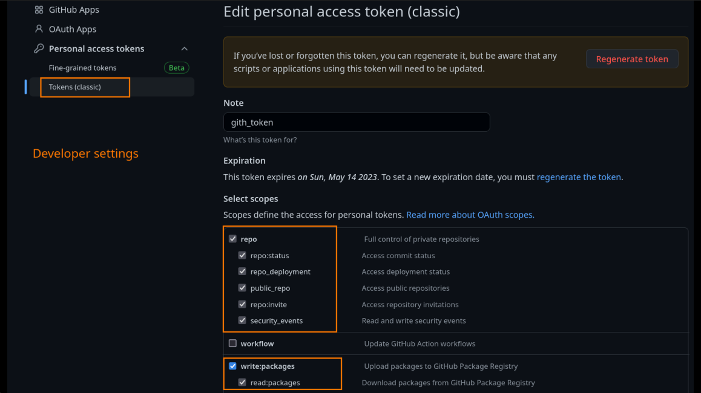

# Zbc FHE tool

This repository allows developers to use __tfhe-rs__ features through a user friendly CLI tool.

This tool could be used locally or through a docker image. 


## Using the published image (easiest way)

One need to docker login to ghcr.io to download the published image.

<br />
<details>
  <summary>How to login into Zama github packages</summary>
<br />

1. Create a PAT (Personnal Access token) in github **developer settings** with a read (write if necessary) access to Zama github registry. 
2. Execute docker login ghcr.io with your **github account name** and the **newly created PAT**.



</details>
<br />

The following command **mount the current directory** in order to persist the created files as keys or ciphertext.
Keys are generated in res/keys and ciphertexts in res/ct.

```bash
docker run -v $PWD:/usr/local/app/ ghcr.io/zama-ai/zbc-fhe-tool:0.1.1 zbc-fhe
export ZBC_FHE_TOOL="docker run ghcr.io/zama-ai/zbc-fhe-tool zbc-fhe"
```

Example:

```bash
docker run -v $PWD:/usr/local/app/ ghcr.io/zama-ai/zbc-fhe-tool:0.1.1 zbc-fhe generate-secret-key base64 2 cks_2_2
$ZBC_FHE_TOOL generate-secret-key base64 2 cks_2_2
```

One can use the docker compose where the mount is already handled. 

```bash
docker compose -f docker-compose.override.yml run app zbc-fhe
```


## Using zbc-fhe tool locally

During the development, one need to generate public and secret FHE keys, or encrypt and decrypt an integer using a convenient encoding format as base64, hex or bin, this is the purpose of this tool. 

To use the src version export the following env variable/create an alias/compile in as a binary release:
```bash
export ZBC_FHE_TOOL="cargo run --release --bin zbc-fhe"
```

## Using the local docker version (with docker-compose to mount current folder)

Build the docker image from the local src:

```bash
docker compose build app
export ZBC_FHE_TOOL="docker compose run app zbc-fhe"
```


## List of example commands

```bash
export ZBC_FHE_TOOL="docker run -v $PWD:/usr/local/app/ ghcr.io/zama-ai/zbc-fhe-tool:0.1.1 zbc-fhe"
```

### Print the global help menu

```bash
$ZBC_FHE_TOOL help
zbc-fhe-tool 0.1.0
Zama <hello@zama.ai>

USAGE:
    zbc-fhe <SUBCOMMAND>

OPTIONS:
    -h, --help       Print help information
    -V, --version    Print version information

SUBCOMMANDS:
    decrypt-integer
            Decrypts an integer with the given FHE secret key
    encrypt-compressed-public-integer
            Encrypts an integer with the compressed public key
    encrypt-integer
            Encrypts an integer with the given FHE secret key
    encrypt-public-integer
            Encrypts an integer with the public key
    generate-full-keys
            Generate ful FHE keys aka cks, sks and pks
    generate-secret-key
            Generate an FHE secret key
    help
            Print this message or the help of the given subcommand(s)
```

### Print menu for a specific command

```bash
$ZBC_FHE_TOOL  generate-secret-key
# zbc-fhe-generate-secret-key 
# Generate an FHE secret key

# USAGE:
#     zbc-fhe generate-secret-key <KEY_FORMAT> <MSG_SIZE> <SECRET_KEY_FILE>

# ARGS:
#     <KEY_FORMAT>         The format of the keys [possible values: hex, base64, bin]
#     <MSG_SIZE>           The parameters of the key (1,2 or 3)
#     <SECRET_KEY_FILE>    A file to save the FHE secret key to

# OPTIONS:
#     -h, --help    Print help information
```

### Generate a new secret key cks

```bash
$ZBC_FHE_TOOL generate-secret-key hex 2 cks_msg2_carry2
# Generating secret key: cks_msg2_carry2 with parameters msg 2 carry 2
ls res/keys/
# cks_msg2_carry2.hex
```

### Encrypt an integer with the newly created secret key

```bash
$ZBC_FHE_TOOL encrypt-integer 2 hex enc_of_2 ./res/keys/cks_msg2_carry2.hex hex
# Encrypting 2 with secret key: res/keys/cks_msg2_carry2.hex
# Key format: Hex
# Ciphertext format: Hex
# Ciphertext: ./res/ct/enc_of_2.hex
```

## Decrypt a ciphertext using the private key

```bash
$ZBC_FHE_TOOL decrypt-integer ./res/ct/enc_of_2.hex hex ./res/keys/cks_msg2_carry2.hex hex
# Decrypting with secret key: ./res/keys/cks_msg2_carry2.hex
# Key format: Hex
# Ciphertext format: Hex
# Ciphertext: ./res/ct/enc_of_2.hex
# Decrypted integer: 2
```

### Generate a full set of keys

```bash
$ZBC_FHE_TOOL generate-full-keys bin 2 key2_2
# Generating key2_2_cks key with parameters msg 2 carry 2
# Generating key2_2_pks key with parameters msg 2 carry 2
# Generating key2_2_sks key with parameters msg 2 carry 2
ls res/keys/
# cks_msg2_carry2.hex  key2_2_cks.bin  key2_2_pks.bin  key2_2_sks.bin
```

### Encrypt an integer with the newly created public key

```bash
$ZBC_FHE_TOOL encrypt-public-integer 3 bin enc_of_3 ./res/keys/key2_2_pks.bin bin
# Encrypting 3 with public key: ./res/keys/key2_2_pks.bin
# Key format: Bin
# Ciphertext format: Bin
# Ciphertext: ./res/ct/enc_of_3.bin
```

